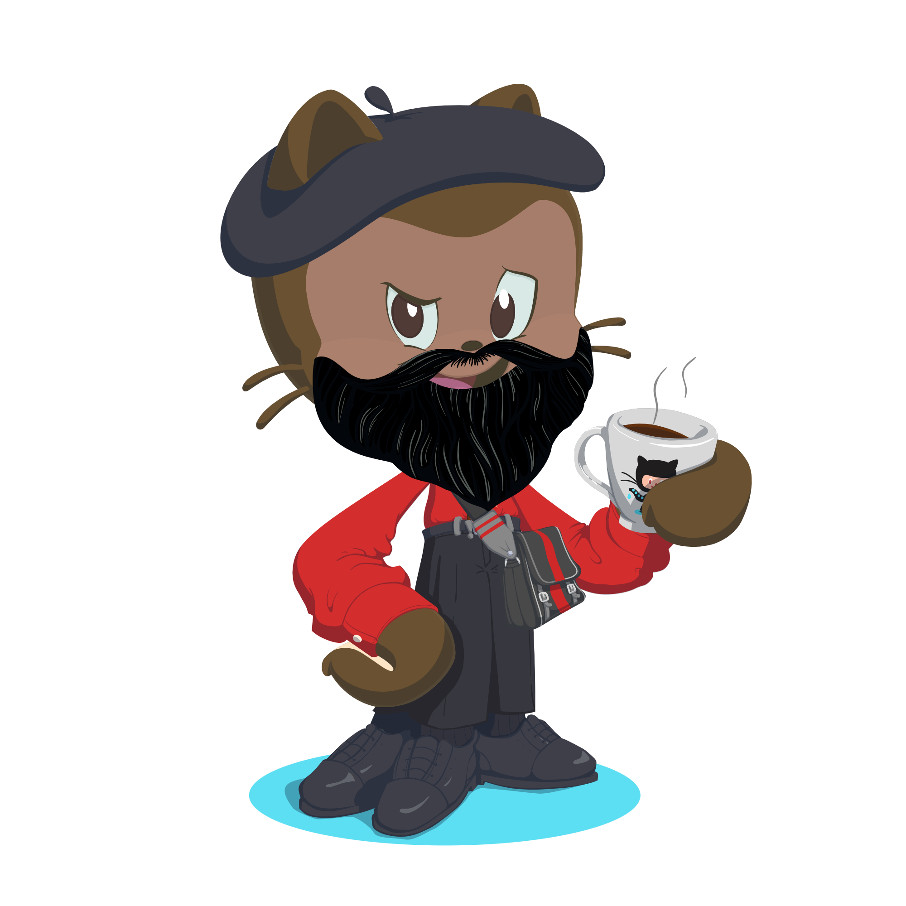

# Olá, Seja bem vindo ao meu perfil no GitHub👋

  <a href="https://github.com/rickps2015">
  
  

## Linguagens de programação, Ferramentas e Tecnologias:

  <!-- Linguagem de programação -->
  
  
  
  
  
  
  
  <!-- Tecnologias -->
  
  
  
  
  
  
  <!-- Ferramentas -->
  
  

## Contatos:

  
  
  

